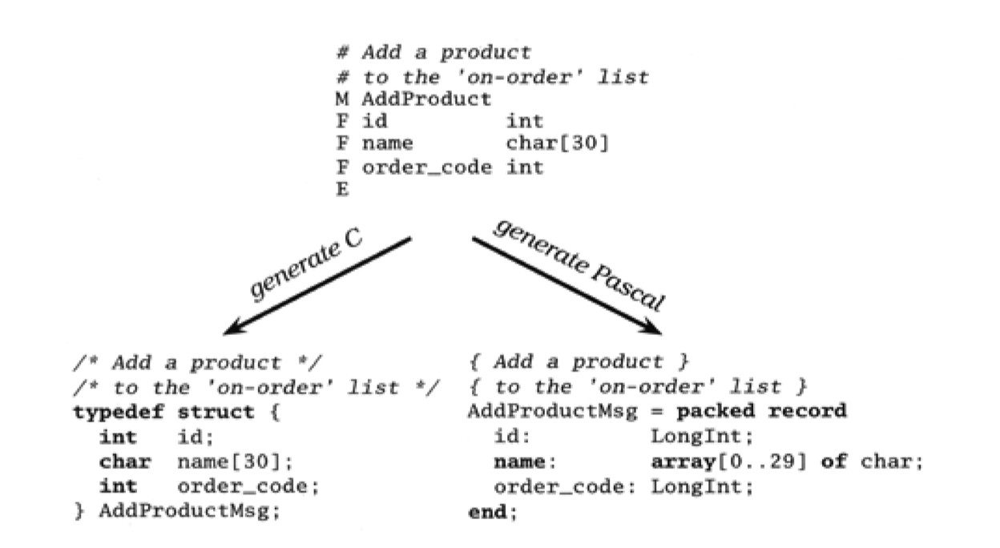
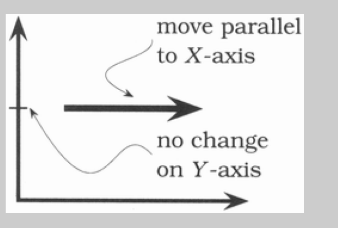
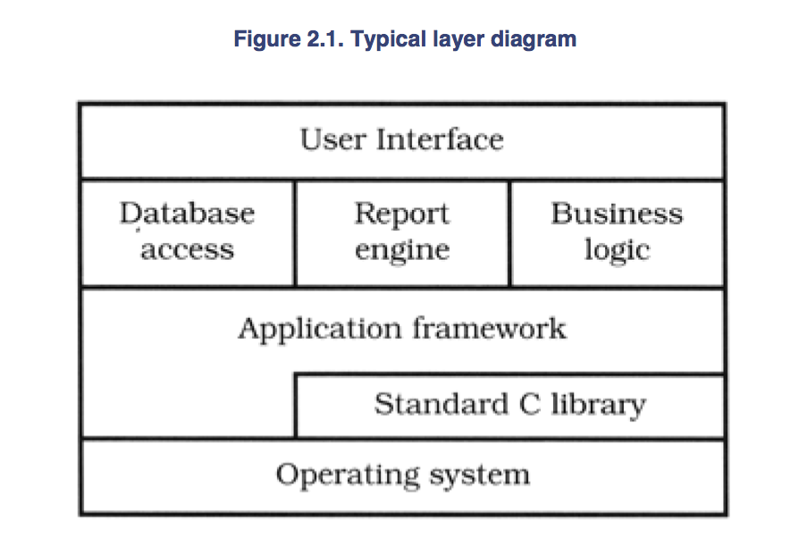

#### A Pragmatic Approach

###### The Evils of Duplication

- As programmers, we collect, organize, maintain, and hardness knowledge
- We document knowledge in specifications, we make it come alive in running code, and we use it to provide checks needed during testing

- Knowledge isn't stable
- It changes - often rapidly
- Your understanding of a requirement maychange following a meeting with the client
- Gov't changes a regulation and some business logic gets outdated
- Tests may show that the chosen algorithm doesn't work
- All this instability means that we spend a large part of our time in maintenance mode, reorganizing and reexpressing the kwnoledge in our systems

- Most people assume that maintenance begins when an application is release, that maintenance means fixing bugs and enhancing features
- This is not correct
- Programmers are constantly in maintenance mode
- Our understanding changes day to day
- New requirements arrive as we're designing or coding
- Perhaps the environment changes
- Maintenance is not a discretea activity but a routine part of the entire dev process

- When we perform maintainence, we have to find and change the representations of those things - those capsules of knowledge embedded in the app
- The problem is that it's easy to dup knowledge in the specs, processes, and programs that we develop, and when we do so, we invite a maintenance nightmare - one that starts well before the app ships

- Only way to develop software reliably, and to make our developments easier to understand and maintain, is to follow what we call the `DRY` principle

```
Every piece of knowledge must have a single, unambigious, authoritative representation within a system
```

- Why do we call it `DRY`?

`Don't repeat yourself`

- Alternative is to have the same thing expressed in two or more places
- If you change one, you have to rememeber to change the others, or your program become buggy b/c of the contradiction

######## How Does Duplication Arise?

- Imposed Duplication: Developers feel they have no chose - the environment seems to require duplication
- Inadvertent Duplication: Developers don't reallize that they are duplication information
- Impatient Duplication: Developers get lazy and duplicate b/c it seems easy
- Interdeveloper duplication: Muliple people on a team (or diffferent teams) duplicate a piece of information


########## Imposed Duplication

- Sometimes duplication seems to be forced upon us
- Project standards may require documents that contain duplicated information 
- Multiple target platforms each require their own programming languages, libraries, and dev environments, which makes us duplicate shared definitions and procedures
- Programming languages themselves require certain structures that duplicate information
- Often there are ways of keeping each piece of knowledge in one place, honoring the `DRY` principle, and making our lives easier at the same time

############ Multiple representations of information

- At the coding level, we often need to have the same info represented in different forms
- Maybe writing a client-server app, using different languages on the client and server, and need to represent some shared structure between both
- Perhaps we need a class whose attributes mirror the schema of a database table

- With a bit of ingenuity you can normally remove the need for duplication
- Often the answer is to write a simple filter or code generator
- Structures in multiple languages can be built from a common metadata representation using a single code generator each time the software is built (Figure 3.4).
- Class definitions can be generated automatically from the online database schema, or from the metadata used to build the schema in the first place
- The trick is to make the process active: this cannot be a one-time conversion, or we're back in a position of duplicating code



############ Documentation in code

- Programmers are taught to comment their code: good code has lots of comments
- Never taught `why` they need comments: bad code `requires` lots of comments

- The `DRY` princple tells us to keep the low-level knowledge in the code, where it belongs, and reserve the comments to other, high-level abstractions
- Otherwise we're duplicating knowledge, and every change means changing both the code and the comments
- Comments inevitably beome out of data, and untrustworthy comments are worse than no comments at all

############ Documentation and Code

- You write documentation, then you write code
- Something changes, and you amend the documentation and update the code
- Documenation and the code contain representations of the same knowledge
- With deadlines looming, we tend to defer to the updating of documentation

Example:
- Client demanded echaustive test specification and required that the software pass all the tests on each delivery
- To Ensure that the tests accurately reflected the application, the team generated them programmatically from the document itself
- When client amended their spec, the test suite changed automatically

############ Language Issues

- Many languages impose considerable duplication in the source
- Often this comes about when the language separates a module's interface from its implementation
- C and C++ have header files that duplicat ethe names and type information of exported variables, functions, and (for C++) classes

- No easy technique for overcoming the requirements of a language

########## Inadvertent Duplication

- Sometimnes, duplication comes about as the result of mistakes in the design

- Example from distribution industry
- Analysis reveals that among other attributes, a truck has a type, a license number, and a driver
- Similarly, a delivery route is a combination of a route, a truck, and a driver
- Code up some classes based on this understanding

- But what happens when Sally calls in sick and we have to change drivers?
- Both `Truck` and `DeliveryRoute` contain driver
- Which one do we change?
- Clearly this duplication is bad
- Does a truck really have a driver as part of its underlying attribute set?
- Does a route?
- Or maybe there needs to be a 3rd object that knits together a driver, a truck, and a route
- Whatever the eventual solution, avoid this kind of unnormalized data

- There is a slightly less obvious kind of unnormalized data that occurs when we have multiple data elements that are mututally dependent
- Let's look at a class representing a line

```
class Line {
    public:
        Point start,
        Point end,
        double length;
}
```

- At first sight, this class might appear reasonable
- A line clearly has a start and end, and will always have a length (even if it's zero)
- But we have duplication
- The length is defined by the start and end points: change one of the points and the length changes
- It's better to make the length a calculated field

```
class Line {
    public:
        Point start;
        Point end;
        double length() { return start.distanceTo(end) }
}
```

- Later on in the dev process, you may choose to violate the DRY principle for performance reasons
- Frequently this occurs when you need to cache data to avoid repeating expensive operations
- The trick is to localize the impact
- The violation is not exposed to the outside world: only the methods within the classes have to worry about keeping things straight

```
class Line {
    private:
        bool changed;
        double length;
        Point start;
        Point end;
    public:
        void setStart(Point p) { start = p; changed = true; }
        void setEnd(Point p) { end = p; changed = true; }
    
    Point getStart(void) { return start; }
    Point getEnd(void) { return end; }

    double getLength() {
        if (changed) {
            length = start.distanceTo(end);
            changed = false;
        }
        return length;
    }
}
```

- When possible always use accessor functions to read and write the attributes of objects
- It will make it easier to add functionality, such as caching, in the future

########## Impatient Duplication

- Every project has time pressures - forces that can drive everyone to take shortcuts
- Need a routine similar to one you've written?
- You'll be tempted to copy the original and make a few changes

- If you feel this temptation, remember `shortcuts make for long delays`
- May well save some seconds now, but at the potential loss of hours later

- Impatient duplication is an easy form to detect and handle, but it takes discipline and a willingness to spend time up front to save pain later

########## Interdeveloper Duplication

- Perhaps the hardest type of duplication to detect and handle occurs between different developers on a project
- Entire sets of functionality may be inadvertently, and that duplication could go undetected for years, leading to maintenance problems

- At a high level, deal with the problem by having a clear design, a strong technical project leader and, and a well-understood division of responsibilities within the design
- However, at the module level, the problem is tougher
- Commonly needed functionality or data that doens't fall into an obvious area of responsibility can get implemented many times over

- Best way to deal with this is to encourage active and frequent communication between devs
- Set up forums to discuss common problems
- Appoint a team member as project librarian, whose job it is to facilitate the exchange of knowledge
- Have a central place in the source tree where utility routines and scripts can be deposited
- Make a point of reaidng other people's source code and documentation, either informally or during code reviews

`Make It Easy to Reuse`

- What you're trying to do is foster an environment where it's easier to find and reuse existing existing stuff than to write it yourself
- `If it isn't easy, people won't do it`
- If you fail to reuse, you risk duplicating knowledge


###### Orthogonality

- Critical concept if you want to produce systems that are easy to design, build, test, and extend
- Often it is an implicit feature of various other methods and techniques you learn
- This is a mistake
- Once you learn to apply the princple of orthogonality directly, you'll notice an immediate improvement in the quality of systems you produce

######## What Is Orthogonality?

- Term borrowed from geometry
- Two lines are orthogonal if they meet at right angles, such as axes on a graph
- In vector terms, the two lines are `independent`
- Move along one of the lines, and your position projected onto the other doesn't change



- In computing, the term has come to signify a kind of independence or decoupling
- Two or more things are orthogonal if changes in one do not affect any of the others
- In a well designed-system, the database code will be orthogonal to the UI: you can change the interface w/o affecting the database, and swap databases without affecting the interface

######## Benefits of Orthogonality

- Nonorthogonal systems are inherently more complex to change and control
- When components of any system are highly interdependent, there is no such thing as a local fix

`Eliminiate Effects Between Unrelated Things`

- We want to design components that are self-contained: independent and with a single, well-defined purpose (cohesion)
- When components are isolated from one another, you know that you can change one without having to worry about the rest
- As long as you don't change the component's external interfaces, you can be comfortable that you won't cause problems that ripple through the entire system

- You get two major benefits if you write orthogonal systems: increased productivity and reduced risk

########## Reduce Risk

- An orthogonal approach reduces the risks inherent in any development

    * Diseased sections of code are isolated
        - If a module is sick, it is less likely to spread the symptoms around the rest of the system
        - It is also easier to slice it out and transplant in something new and healthy
    * The resulting system is less fragile
        - Make small changes and fixes to a particular area, and any problems you generate will be restricted to that area
    * An orthogonal system will probably be better tested, because it will be easier to design and run tests on its components
    * You will not be as tightly tied to a particular vendor, product, or platform, b/c the interfaces to these 3rd party components will be isolated to smaller parts of the overall development

######## Project Teams

- Some teams argue a lot and some teams are very efficient

- Often this is an orthogonality issue
- When teams are organized with lots of overlap, memebers are confused about responsibilities
- Every change needs a meeting of the entire team, b/c any of them `might` be affected

- No simple anwer to organizing teams into groups with well-defined responsibilities and minimal overlap
- It depends partly on the project and your analysis of the areas of potential change
- Also depends on ythe people you have available
- Preference is to start by separating infrastructure from application
- Each major infrastructure component (data, communications interface, middleware layer, and so on) gets its own subteam
- Each obvious division of application functionality is similarly divided
- Then look at people you have (or plan to) and adjusting the groupings accordingly

- Can get an informal measure of the orthgonality of a project team's structure
- Simply see how many people `need` to be involved in discussing each change that is requested
- The larger the number, the less orthogonal the group

######## Design

- Most devs are familiar with the need to design orthogonal systems, although they may use words such as `modular`, `component-based`, and `layered` to describe the process
- Systems should be composed of a set of cooperating modules, each of which implements functionality independent of others
- `Sometimes these components are organized into layers, each providing a level of abstraction`
- This layered approach is a powerful way to design orthogonal systems
- Because each layer uses only the abstractions provided by the layers belw it, you have great flexibililty in changing underlying implementations w/o affecting code
- Layering also reduces the risk of runaway dependencies between modules
- Figure below is a common layering diagram



- There is an easy test for orthogonal design
- Once you have your components mapped out, ask yourself `If I dramatically change the requirements behind a particular function, how many modules are affected`
- In an orthogonal system, the answer should be `one`
- Moving a button on a GUI panel should not require a change in the database schema
- Adding context-sensitive help should not change the billing subsystem

- In reality, this expectation is native
- Unless you are remarkably lucky, most real-world requirement changes will affect multiple functions in the system
- Howeer, if you analyze the change in terms of functions, each functional change should still ideally affect just one module

- Let's consider a complex system for monitoring and controlling a heating plant
- Original requirement called for a GUI, but the requirements were chagned to add a voice response system with touchtone telephone control of the plant
- In an orthogonally designed system, you would need to change only those modules associated with the user interface to handle this
    - The underlying logic of controlling the plan would remain unchanged
- In fact, if you structure your system carefully, you should be able to support both interfaces with the same underlying code base
- MVC works well in this situation

- Also ask yourself how decoupled your design is from changes in the real world
- Are you using a telephone number as a customer identifier?
- What happens when the phone company reassigns area codes?
- `Don't rely on the properties of things you can't control`

######## Toolkits and Libraries

- Be careful to preserve the orthogonality of your system as you introduce 3rd party toolkits and libraries

- When you bring in a toolkit ask yourself whether it imposes changes on your code that shouldn't be there
- If an object persistence scheme is transparent, then it's orthogonal
- If it requires you to create or access objects in a special way, then it's not
- Keeping such details isolated from your code has the added benefit of making it easier to change vendors in the future

- Interesting twist on orthogonality is Aspect-Oriented Programming (AOP)
- AOP lets you express in one place behavior that would otherwise be distributed throughout your source code
- For example, log messages are normally generated by sprinkling calls to some log function throughout your source
- With AOP, you implement orthogonally to the things being logged


######## Coding

- Every time you write code you run the risk of reducing orthogonality of your application
- Unless you constantly monitor not just what you are doing but also the larger context of the application, you might unintentionally duplicate functionality in some other module, or express existing knowledge twice

- Several techniques you can use to maintain orthogonality
    * Keep your code decoupled
        - Write shy code - modules that don't reveal anything unnecessary to other modules and that don't rely on other modules' implementations
        - Law of Demeter
        - If you need to change the object's state, get the object to do it for you
        - This way your code remains isolated from the other code's implementation and increases the chances that you'll remain orthogonal
    * Avoid global data
        - Every time your code references global data, it ties itself into the other components that share that data
        - Even globals that you intend only to read can lead to trouble (for exampl,e you suddenly need to change your code to be multithreaded)
        - In general, code is easier to understand and maintain if you explicitly pass any required context into your modules
        - In OO applications, context is often passed as parameters to objects' constructors
        - In other code, you create structures containing the context and pass around references to them

        - The Singleton pattern in `Design Patterns` is a way of ensuring that there is only one instance of an object of a particular class
        - Many people use these singleton object as a kind of global variable
        - Be careful with singletons - they can also lead to unnecessary linkage
    * Avoid similar functions
        - Often you'll come across a set of functions that all look similar - maybe they share common code at the start and end, but each has a different central algorithm
        - Duplicate code is a symptom of structural problems
        - Have a look at the Strategy pattern in `Design Patterns` for a better implementation

- Get into the habit of being constantly critical of your code
- Look for any opportunities to reorganize to improve its structure and orthogonality

######## Testing

- An othogonally designed and implemented system is easier to test
- B/c the interactions vtwn the system's components are formalized and limited, more of the system testing can be performed at the individual module level
- That is good b/c module level (or unit) testing is easier to specify and perform than integration testing 
- Every module should have its own unit test built into its code

- Building tests is itself an interesting test of orthogonality
- What does it take to build and link a unit test?
- Do you have to drag in a large percentage of the rest of the system just to get a test to compile or link?
- If so, you've found a module that is not well decoupled from the rest of the system

- `Bug fixing is also a good time to assess the orthogonality of the system as a whole`
- When you come across a problem, assess how localized the fix is
- Do you change just one module, or are the changes scattered throughout the entire system?
- When you make a change, does it fix everything, or do other problems mysteriously arise?
- If you use a source code control system, tag bug fixes when you check the code back in after testing
- You can then run monthly reports analyzing trends in the number of source files affected by each bug fix

######## Documentation

- Orthogonality also applies to to docs
- The axes are content and presentation
- W/ truly orthogonal documentation, you should be able to change the appearance dramatically w/o changing the content

######## Living with Orthogonality

- Closely related to the DRY principle
- With DRY, you're looking to minimize duplication within a system, whereas with orthogonality you reduce the interdependency among the system's components
- If you use orthogonality combined closely with DRY, you'll find that systems are more flexible, more understandable, and easier to debug, test, and maintain