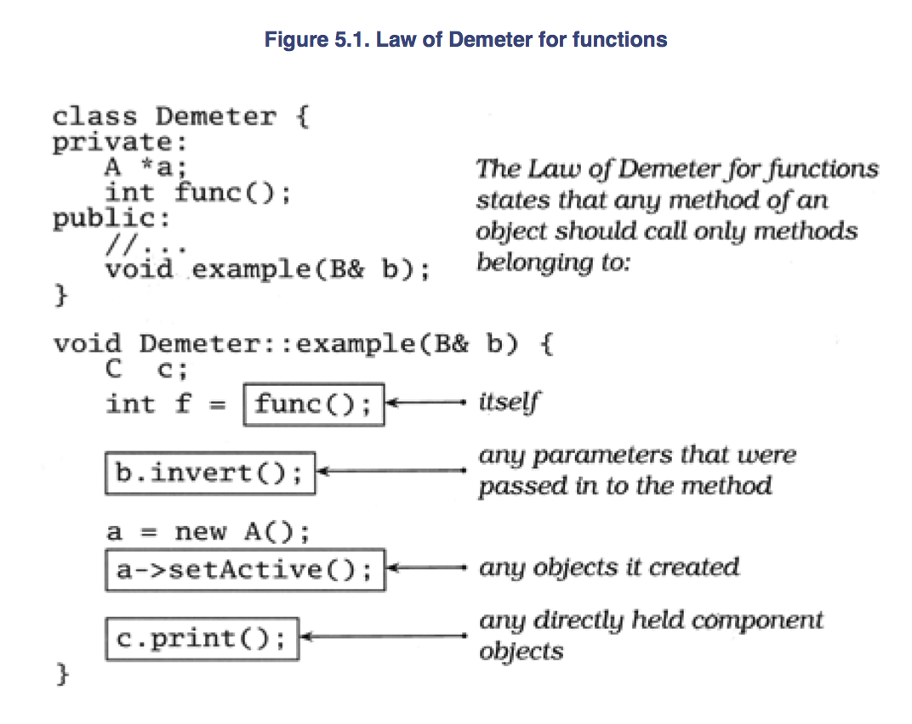
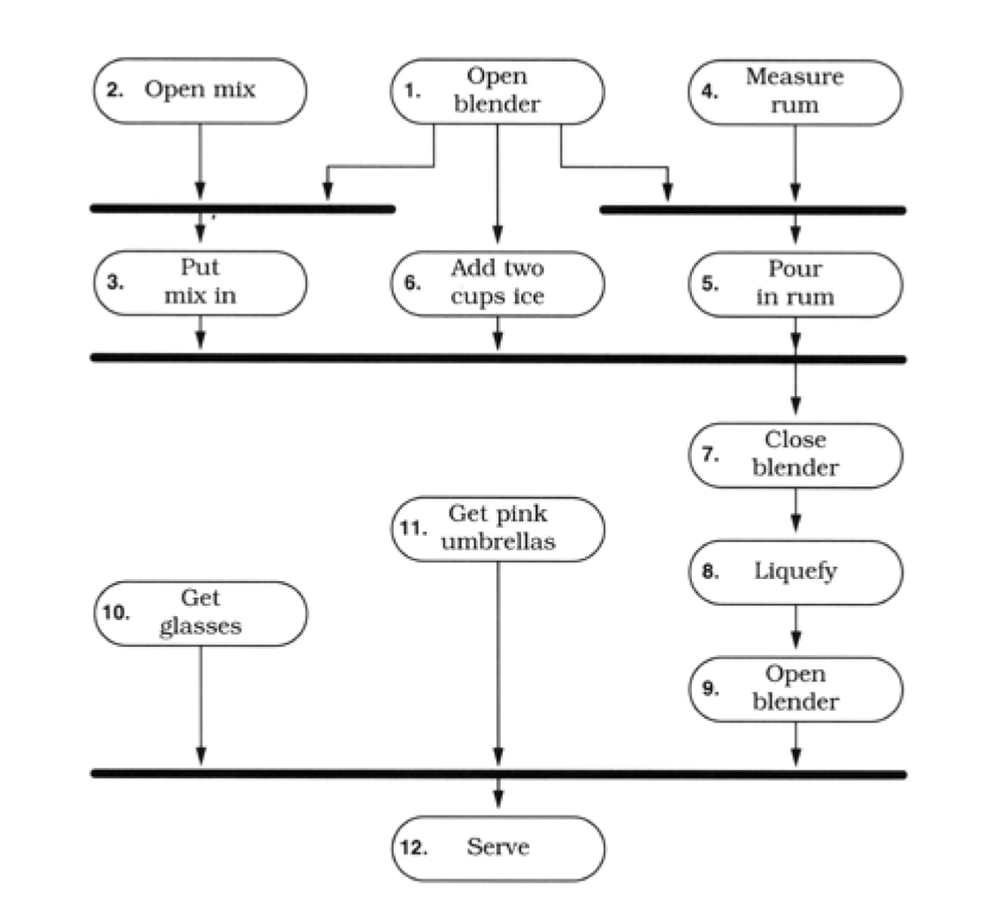
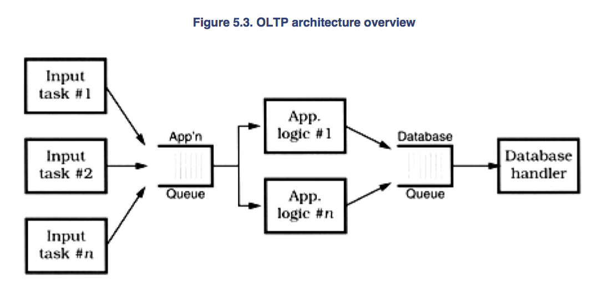
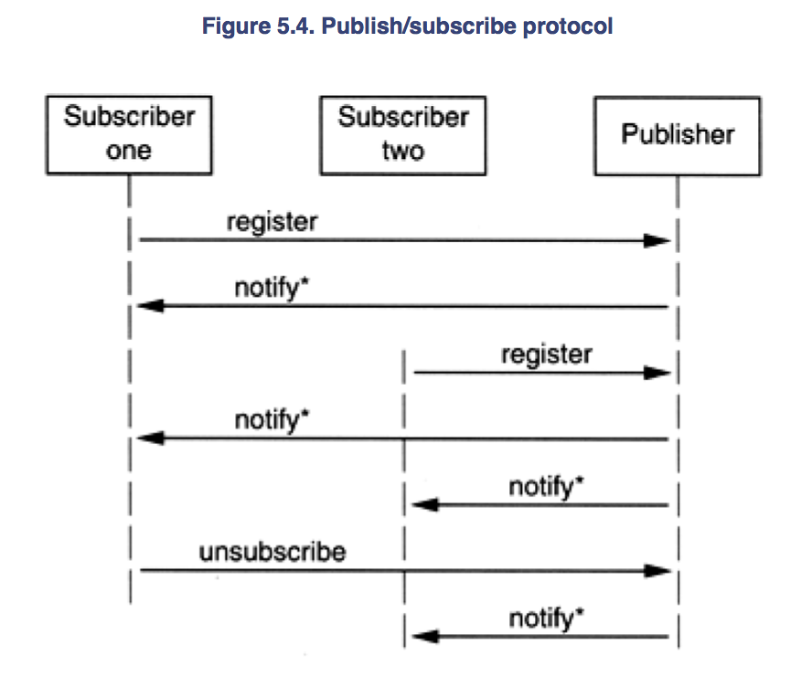
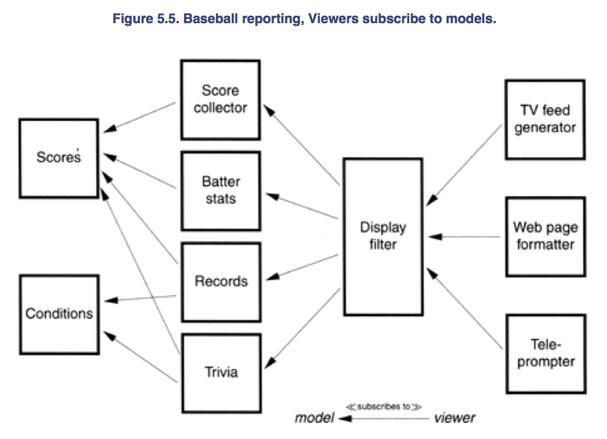
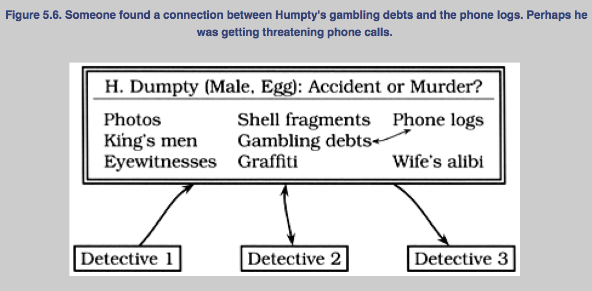

#### Bend or Break

- In order to keep up with today's near-frantic pace of change, we need to make eery effort to write code that's as loose - as flexible - as possible
- Otherwise we may found our code quickly becomes outdated, or too brittle to fix, and may ultimately be left behing in the mad dash toward the future

- This chapter is about how to make `reversible` decisions, so your code can stay flexible and adaptable in the face of an uncertain world

- First we need to look at `coupling` - the dependencies amoung modules of code

- A good way to stay flxible is to write `less code`
- Changing code leaves you open to the possibility of introducing new bugs

- A key concept is the separation of a data `model` from a `view`

- Another is a technique for decoupling modules even further by providing a meeting place where modules can exchange data anonymously and asynchronously


###### Decoupling and the Law of Demeter

`Good fences make good neighbors`

- Writing `shy` code is benefical
- It works in two ways: `don't reveal yourself to others and don't interace with too many people`

- Organize your code into modules and limit the interaction between them
- If one module then gets compromised and has to be replaced, the other modules should be able to carry on

######## Minimize Coupling

- What's wrong with having modules that know about each other
- Nothing in principle
- `However, you do need to be careful about how many other modules you interact with, and more importantly, how you interact with them`

- Suppose you're remodeling your house, or building a house from scratch
- A typical arrangement involves a general contractor
- You hire the contractor to get the work done, but the contractor may or may not do the construction personally; the work may be offered to various subcontractors
- But as the client, you are not involved in dealing with the subcontractors directly - the general contractor assumes that set of headaches on your behalf

- Follow this same module in software
- When we ask an object for a particular service, we'd like the service to be performed on our behalf
- We do `not` want the object to give us a 3rd party object that we have to deal with to get the required service

- For example, suppose you are writing a class that generates a graph of scientific recorder data
- You have data recorders around the world; each recorder object contains a location object giving its position and time zone
- You want to let your users select the recorder and plot its data, labeled with the correct time zone
- You might write

```
public void plotDate(Date aDate, Selection aSelection) {
    TimeZone tz = aSelection.getRecorder().getLocation().getTimeZone();
}
```

- But now the plotting routine is unnecessarily coupled to `three` classes - `Selection`, `Recorder`, and `Location`
- This style of coding dramatically increases the number of classes on which our classes depend
- Why is this a bad thing?
- It increases the risk of an unrelated change somewhere else in the system will affect `your` code
- For instance, if Fred makes a change to `Location` such that it no longer directly contains a `TimeZone`, you have to change your code as well

- Rather than digging through the hierarchy yourself, you just ask for what you need directly

```
```
public void plotDate(Date aDate, TimeZone aTz) {
    ...
}
```
plotDate(someDate, someSelection.getTimeZone());
```

- We added a method to `Selection` to get the time zone on our behalf: the plotting routine doesn't care whether the time zone comes directly from the `Recorder` directly, from some contained object within `Recorder`, or whether `Selection` makes up a different time zone entirely
- The selection routine, in turn, should probably just ask the recorder for its time zone, leaving it up to the recorder to get it from its contained `Location` object

- Traversing relationships between objects directly can quickly lead to a combinatorial explosion of dependency relationships
- You can see this when:

1. `Simple` changes to one module that propagate through unrelated modules in the system
2. Developers who are afraid to change code b/c they aren't sure what might be affected

- Systems with unnecessary dependencies are very hard (and expensive) to maintain, and tend to be highly unstable
- In order to keep dependencies to a minimum, we'll use the `Law of Demeter` to design our methods and functions

######## The Law of Demeter for Fuctions

- The Law of Demeter for functions attempts to minimize coupling btwn modules in any given program
- It tries to prevent you from reaching into an object to gain access ot a 3rd object's methods



- By writing `shy` code that honors the Law of Demeter as much as possible, we can achieve our objective

`Minimize Coupling Between Modules`

######## Does It Really Make a Difference?

- Does this really help to create maintainable code

- Studies have shown that classes in C++ with larger `response sets` are more prone to error than classes with smaller response sets (`a "response set" is defined to be the number of functions directly invoked by methods of the class`)

- B/c following the Law of Demeter reduces the size of the response set in the calling class, it follows that classes designed this way will also tend to have fewer errors

- Using the Law of Demter will make your code more adaptable and robust, but at a cost: as a `general contractor` your module must delegate and manage any and all subcontractors directly, w/o involving clients of your modules
- In practice this means that you will be writing a large number of wrapper methods that simply forward the request on to a delegate
- These wrapper methods will impose both a runtime cost and a space overhead, which may be significant in some applications

- You must balance the pros and cons of for your particular application
- In database schema desing, it is common practice to `denormalize` the schema for a performance improvement: to violate the rules of normalization in exchange for speed
- A similar tradeoff can be made here as well
- In fact, reversing the Law of Demeter and `tightly` coupling several modules, you may realize an important performance gain
- As long as it is well known and acceptable for those modules to be coupled, your design is fine

######## Physical decoupling

- Relationship among files, directories, and libraries that make up a system
- Logical and physical design must proceed in tandem


###### Metaprogramming

`No amount of genius can overcome a population with detail`

######## Levy's Eigth Law

- Deatils mess up our pristine code - especially if they change frequently
- Every time we have to go in and change the code to accommodate some change in business logic, or in the law, or in management's personal tastes of the day, we run the risk of breaking the sysmte - of introducing a new bug

- So get the details out of the code
- While we're at it, we can make our code highly configurable and `soft` - that is, easily adaptable to changes

######## Dynamic Configuration

- Want to make our systems highly configurable
- Not just things such as screen colors and prompt text, but deeply ingrained items such as choice of algorithms, database products, middleware technology, and user-interface style
- These items should be implemented as configurable options, not through intergration or engineering

`Configure, Don't Integrate`

- Use `metadata` to describe configuration options for an application: tuning parameters, user preferences, the installation directory, and so on

- What exactly is metadata?
- It is data about data
- The most common example is probably a database schema or data dictionary
- A schema contains data that describes fields (columns) in terms of names, storage lengths, and other attributes
- You should be able to access and manipulate this information just as you would any other data in the database

- Metadata is any data that describes the application - how it should run, what resources it should use, and so on
- Typically metadata is accessed and used at runtime, not at compile time
- You use metadata all the time - at least your programs do
- Suppose you click on an option to hide the toolbar on your Web browser
- The browser will store that preference, as metadata, in some sort of internal database

- This database might be in a proprietary frmat, or it might use a standard mechanism
- Under Windows, either an initialization file (.ini file) or entries in the system Registry are typical
- Under Unix, the X Window System provides similar functionality using Application Default files
- Java uses Property files
- In all of these environments, you specify a key to retrieve a value
- Alternatively, more powerful and flexible implementations of metadata use an embedded scripting language

######## Metadata-Driven Applications

- We want to go beyond using metadata for simple preferences
- Want to configure and drive the application via metadata as much as possible
- Our goal is to think declaratively (specifying `what` is to be done, not `how`) and create highly dynamic and adaptable programs
- We do this by adopting a general rule: `program for the general case, and put the specifics somewhere else - outside the compliled code base`

`Put Abstractions in Code Details in Metadata`

- There are several benefits to this approach
    * It forces you to decouple your design, which results in a more flexible and adaptable program
    * It forces you to create a more robust, abstract design by deferring details - deferring them all the way out of the program
    * You can customize the application without recompiling it
    * You can also use this level of customization to provide easy work-arounds for critical bugs in live production system
    * Metadata can be expressed in a manner that's much closer to the problem domain than a general-purpose programming language might be
    * You may even be able to implement several different projects using the same application engine, but with different metadata

- We want to defer definition of most details until the last moment, and leave the details as soft - easy to change - as we can
- By crafting a solution that allows us to make changes quickly, we stand a better chance of coping with the flood of directional shifts that swamp many projects

########## Business Logic

- So you've made the choice of database engine a configuration option, and provided metadata to determine the user-interface style
- We can do more

- B/c business policy and rules are more likely to change than any other aspect of the project, it makes sense to maintain them in a very flexible format

- For example, your purchasing application may include various corporate policies
- Maybe you pay small suppliers in 45 days and large ones in 90 days
- Make the definitions of the supplier types, as well as the time periods thems, configurable
- Take the opportunity to generalize

- Maybe you are writing a system with horrendous workflow requirements
- Actions start and stop according to complex (and changing) business rules
- Consider encoding them in some kind of rule-based (or expert) system, embedded in your application
- That way, you'll configure it by writing rules, not cutting code

- Less complex logic can be expressed using a mini-language, removing the need ot recompile and redeploy when the environment changes

####### When to Configure

- Recommend representing configuration data in plain text - it makes life much easier

- But when should a program read this configuration?
- Many programs will scan such things only at startup, which is unfortunate
- If you need yo change the configuration, this forces you to restart the application
- A more flexible approach is to write programs that can reload their configuration while they're running
- This flexibility comes at a cost: it is more complex to implement

- Consider how your application will be used
- If it is a long-running server process, you will want to provide some way to reread and apply metadata while the program is running
- For a small GUI application that restarts quickly, you may not need to

- This phenomenon is not limited to application code
- We've all been annoyed at operations systems that force us to reboot when we install some simple application or change an innocuous parameter

########## Cooperative Configuration

- What happens if you let applications configure each other - software that adapts itself to its environment?
- Unplanned, spur of the momement configuration of existing software is a powerful concept

- Operating systems already confgure themselves to hardware as they boot, and Web browsers update themselves with new components automatically

- Your larger applications probably already have issues with handling different versions of data and different releases of libraries and operating systems
- A more dynamic approach would help

######## Don't Write Dodo-Code

- W/o metadata, your code is not as adapatable or flexible as it could be
- Code will die eventually if it does not adapt (just like we see in the real world)


###### Temporal Coupling

- Time is an often ignored aspect of software architectures
- The only time that preoccupies us is the time on the schedule, the time left until we ship - but that is not what is being talked about
- Instead, we are talking about the role of time as a design element of the software itself
- There are two aspects of time that are important to us: 
    * concurrency - things happening at the same time
    * order - the relative positions of things in time

- We don't usually approach with either of these aspects in mind
- When people first sit down to design an architecture or write a program, things tend to be linear
- That's the way more people think - `do this and then always do that`
- But thinking this way leads to `temporal coupling`
    * Coupling in time
- Method A must always be called before method B; only one report can be run at a time; you must wait for the screen to redraw before the button click is received. `Tick must happen before tock`

- The approach is not very flexible, and not very realistic

- We need to allow for concurrency and to think about decoupling any time or order dependencies
- In doing so, we can gain flexibility and reduce time-based dependencies in many areas of development: workflow analysis, architecture, design, and deployment

######## Workflow

- On many projects, we need to model and analyze the users' workflows as part of the requirements analysis
- `We'd like to find out what can happen at the same time, and what must happen in a strict order`

- One way to capture their description of workflow using notations such as the `UML activity diagram`

- An activity diagram consists of a set of actions drawn as rounded boxes
- The arrow leaving an action leads to either another action (which can start once the first action completes) or to a thick line called a `synchronization bar`
- Once `all` of the actions leading into a synchronization bar are complete, you can then proceed along any arrows leaving the bar
- An action with no arrows leading into it can be started at any time

- You can use activity diagrams to maximize parallelism by identifying activities that could be performed in parallel, but aren't

`Analyze Workflow to Improve Concurrency`

- For instance, let's take a blender project, users may initially describe their current workflows as follows

1. Open blender
2. Open pina colada mix
3. Put mix in blender
4. Measure 1/2 cup of rum
5. Pour in rum
6. Add 2 cups of ice
7. Close blender
8. Liquefy for 2 minutes
9. Open blender
10. Get glasses
11. Get pink umbrellas
12. Serve

- Even though they describe these actions serially, and may even perform them serially, we notice that many of them could be performed in parallel



- In this instance, the top level tasks (1, 2, 4, 10, 11) can all happen concurrently
- Tasks 3, 5, and 6 can happen in parallel later

######## Architecture

- On-Line Transaction Processing (OTLP) example
- All the system had to do was read a request and process the transaction against the database
- 3 tier, multiprocessing distributed application: each component was an independent entity that ran concurrently with all other components
- This may sounds like more work, it was't
- Taking advantage of temporal decoupling made it `easier` to write

- System takes in requests from a large number of data communication lines and processes transactions against a back-end database

- The design addresses the following constraints
    * Database operations take a relatively long time to complete
    * For each transaction, must not block communication services while a database transaction is being processed
    * Database performance suffers with too many concurrent sessions
    * Multiple transactions are in progress concurrently on each data line

- The solution that gave best performance and cleanest architecture looked something like below



- Each box represents a separate process; processes communicate via work queues
- Each input process monitors one incoming communication line, and makes requests to the application server
- All requests are async: as soon as the input process makes it current request, it goes back to monitoring the line for more trafffic
- Similarly, the application server makes requests of the datatbase process, and is notified when the individual transaction is complete

- This example shows a way to get quick and dirty load balancing among multiple consumer processes: `the hungry consumer` model

- In a hungry consumer model, you replace the central scheduler with a number of independent consumer tasks and a centralized work queue
- Each consumer task grabs a piece from the work queue, and goes on about the business of processing it
- As each task finishes its work, it goes back to the queue for some more
- This way, if any particular task gets bogged down, the others can pick up the slack, and eah individual component can proceed at its own pace
- Each component is temporally decoupled from the others

`Design using Services`

- Instead of creating components, we really have created `services` - independent, concurrent objects behind well-defined, consisten interfaces

######## Design for Concurrency

- Programming with threads imposes some design constraints - and that's a good thing
- Those constraints are actually so helpful that we want to abide by them whenever we program
- It will help us decouple our code and fight `programming by coincidence`

- With linear code, it's easy to make assumptions that lead to sloppy code
- But concurrency forces you to think through things a bit more carefully
- B/c things can now happen at the `same time`, you may suddenly see some time-based dependencies

- To begin with, any global static variables must be protected from concurrent access
- Now may be a good time to ask yourself `why` you need a global variable in the first plac
- In addition, you need to make sure that you present consistent state information, regardless of the order of calls
- For example, when is it valid to query the state of your object?
- If your object is in an invalid state between certain calls, you may be relying on a coincidence that no one can call your object at that point in time you may be relying on a coincidence that no one can call your object at that point in time

- Suppose you have a windowing subsystem where widgets ar first created and then shown on display in two separate steps
- You aren't allowed to set state in the widget until it is shown
- Depending on how the code is set up, you may be relying on that fact that no other object can use the created widget until you've shown it on screen

- But this may not be true in a concurrrent system
- Objects must always be in a valid state when called, and they can be called at the most awkward times
- You must ensure that an object is in a valid state `any time` it could possibly be called
- Often this problem shows up with classes that define separate constructor and initialization routines (where the constructor doesn't leave the object in an initialized state)
- Using class invariants, will help you avoid this trap

`Always Design for Concurrency`

######## Deployment

- Once you've designed an architecture with an element of concurrency, it becomes easier to think about handling `many` concurrent services: the model becomes pervasive

- Now you can be flexible as how to the application is deployed: standalone, client-server, or n-tier
- By architecting your system as independent services, you can make the configuration dynamic as well
- By planning for concurrency, and decoupling operations in time, you have all these options - including stand-alone option, where you can choose `not` to be concurrent

- Going the other way (trying to add concurrency to a nonconcurrent application) is much harder
- If we design to allow concurrency, we can more easily meet scalability or performance requirements when the time comes - and if the time never comes, we still have the benefit of a cleaner design


###### It's Just a View

- Early on we are taught not to program as a single big chunk, but that we should `divide and conquer` and separate a program into modules
- Each module has its own responsibilities; in fact, a good definition of a module (or class) is that it has a single, well-defined responsibility

- But once you separate a program into different modules based on responsibility, you have a new problem
- At runtime, how do objects talk to each other?
- How do you manage the logical dependencies between them?
- That is, how do we synchronize changes in state (or updates to data values) in these different objects?
- It needs to be done in a clean, flexible manner - we don't want them to know too much about each other

- An event is simply a special message that says `something interesting just happened`
- We can use events to signal changes in one object that some other object may be interested in

- Using events in this way minimizes coupling between those objects - the sender of the event doesn't need to have any explicit knowledge of the receiver
- In fact, there could be multiple receivers, each one focused on its own agenda (of which the sender is blissfully unaware)

###### Publish/Subscribe

- Why is it bad to push all events through a single routine?
- It violates object encapsulation - that one routine now has to have intimate knowledge of interactions among many objects
- It also increases coupling
- B/c the objects themselves have to have knowledge of these events as well, you are probably going to violate the `DRY` principle and orthogonality
- You have seen this kind of code - it is usually dominated by a huge `case` statement or a multiway `if-then`
- There is a better way

Object should be able to register to receive only the events they need and should never be sent events they don't need, and should never be sent events they don't need
- We don't want to spam our objects
- Instead, we can use a `publish/subscribe` protocol



- A sequence diagram shows the flow of messages among several objects, with objects arrange in columns
- Each Message is shown as a labeled arrow from the sender's column to the receiver's column
- An asterik in the label means that more than one message of this type can be sent

- If we are interested in certain events generated by a `Publisher`, all we have to do is register ourselves
- The `Publisher` keeps track of all interested `Subscriber` objects; when a `Publisher` generates an event of interst, it will call each `Subscriber` in turn and notify them that the event has occurred

- There are several variations of this theme - mirroring other communication styles
- Objects may use publish/subscribe on a peer-to-peer baseis
- They may use a `software bus` where a centralized object maintains the database of listeners and dispatched messages appropriately
- You might even have a scheme where critical events get broadcast to all listeners - registered or not
- One possible implementation of events in a distributed environment is illustrated by the COBRA Event Service (described below)

- We can use this publish/subscribe mechaism to implement a very important design concept: `the separation of a model from the views of the model`

######## The COBRA Event Service

- The COBRA Event Service allows participating objects to send and receive event notificationos via a common bus, the `event channel`
- The event channel arbitrates event handling, and also decouples event producers from event consumers
- It works in two basic ways: `push` and `pull`

- In push mode, event suppliers inform the event channel that an event has occurred
- The channel then automatically distributes that event to all client objects that have registered interest

- In pull mode, the clients periodically poll the event channel, which in turn polls the supplier that offers event data corresponding to the request

- Although the COBRA Event service can be used to implement all of the event models discussed in this section
- COBRA facilitates communication among objects written in different programming languages running geographically dispered machines with different architectures
- Sitting on top of COBRA, the event service gives you a decoupled way of interacting with apps around the world, written by people you've never met, using programming languages you'd rather not know

######## Model-View-Controller

- Suppose you have a spreadsheet application
- In addition to the numbers in the spreadsheet itself, you also have a graph that displays the numbers as a bar chart and a running total dialog box that shows the sum of a colummn in the spreadsheet

- Obviously we don't want to have 3 separate copies of the data
- So we create a `model` - the data itself, with common operations to manipulate it
- Then we create separate `views` that display the data in different ways: as a spreadsheet, as a graph, or in a totals box
- Each of these views may have its own `controller`
- The graph view may have a controller that allows you to zoom in or out, or pan around the data
-  None of this affects the data itself, just the view

- This is the key concept behind MVC - separating the model from both the GUI that represents it and the controls that manage the view
    * The view and controller are tightly coupled, and in some implementations of MVC the view and controller are a single component

- By doing so, you can take advantage of some interesting possibilities
- You can support multiple views of the same data model
- You can use commomn viewers on many different data models
- You can even support multiple controllers to provide nontraditional input mechanisms

`Separate Views from Models`

- By loosening the coupling btwn the model and the view/controller, you buy yourself a lot of flexibility at low cost
- This technique is one of the most important ways of maintaining reversibility

########## Java View Tree

- Good example of MVC design can be found in the Java tree widget
- The tree widget (which displays a clickable, traversable tree) is actually a set of several different classes organized in an MVC pattern

- To produce a fully functional tree widget, all you need to do is provide a data source that conforms to the `TreeModel` interface
- Your code now becomes the model for the tree

- The view is created by the `TreeCellRenderer` and `TreeCellEditor` classes which can be inherited from and customized to provide different colors, fonts, and icons int he widget
- `JTree` acts as the controller for the tree widget and provides some general viewing functionality

- Because we have decoupled the model from the view, we simply the programming a great deal
- You don't have to think about programming a tree widget anymore
- Instead you just provide a data source

- Suppose the vice president comes up to you and wants a quick application that lets her navigate the company's organizational chart, which is held in a legacy database on the mainframe
- Just write a wrapper that takes the mainframe data, presents it as a `TreeModel` and now you have full navigatable tree widget

######## Beyond GUIs

- While MVC is typically caught in the context of GUI development, it is really a general purpose programming technique
- The view is an interpretation of the model - it doesn't need to be graphical
- The controller is more of a coordination mechanism, and doesn't have to be related to any sort of input device

* Model: The abstract data model representing the target object. The model has no direct knowledge of any views or controllers
* View: A way to interpret the model. It subscribes to changes in the model and logical events from the controller
* Controller: A way to control the view and provide the model with new data. It publishes events to both the model and the view

- Nongraphical example
- Charged with developing software to support baseball announcers who need to report on scores, statistics, and the trivia

- Need information on the game in progress - the teams playing, the conditions, the player at bat, the score, and so on
- These facts form our models: they will be updated as new information arrives (a pitcher is changed, a player strikes out, it starts raining...)

- We'll then have a number of view objects that use these models
- One view might look for runs so it can update the current score
- Another may receive notifications of new batters, and retrieve a brief summary of their year-to-date statistics
- A third viewer may look at the data and check for new world records

- Don't want to flood announer with all of these views directly
- Instead, we'll have each view generate notifications of `interesting` events, and let some higher-level object schedule what gets shown

- These viewer objet have suddenly become modules for the higher-level object, which itself might then be a model for different formatting viewers
- One formattng viewers might create teleprompter script for the announcer, another might generate video captions directly ont the satellitle uplink, another might udpate the network's ot team's Web pages



- This kind of model-viewer network is a common (and valuable) design technique
- Each link decouples raw data from the events taht created it - each new viewer is an abstraction
- And b/c the relationships are a network (not just a linear chain), we have a lot of flexibility
- Each model may have many viewers, and one viewer may work with multiple models

- In advanced systems such as this one, it can be handy to have `debugging` views - specialized views that show you in-depth details of the model
- Adding a facility to trace individual events can be a great time saver as well

######## Still Coupled (After All These Years)

- Despite the decrrease in coupling we have achieved, listeners and event generators (subscribers and publishers) still have `some` knowledge of each other
- In Java, for instance, they must agree on common interface definitions and calling conventions


########## Blackboards

- Consider how detectives might use a blackboard to coordinate and solve a murder investigation
- Suppose a chief inspector starts off by setting up a blackboard in the conference room

- Each detective may make contributions to this potential murder mystery by adding facts, statements from witnesses, any forensic evidence that might arise, and so on
- As the data accumulates, a detective might notice a connection and post that observation or speculation as well
- This process continues, across all shifts, with many different people and agents, until the case is closed
- A sample is shown below



- Some key features of the blackboard approach are:
    * None of the detectives need to know of the existence of any other detective - they want the board for new infromation, and add their findings
    * The detectives may be trained in different disciplines, may have different levels of education and expertise, and may not even work in the same precinct
    * They share a desire to solve the case, but that's all
    * Different detectives may come and go during the course of the process, and may work different shifts
    * There are no restrictions on what may be placed on the blackboard. It may be pictures, sentences, physical evidence, and so on

- Authors have worked on a number of projects that involved a workflow or distributed data gathering proess
- With each, designing a solution around a simple blackboard model creates a solid metaphor to work with: all features above using detectives are just as applicable to objects and code modules

- A blackboard sysmte lets us decouple our objects from each other completely, providing a forum where knowledge consumers and producers can exchange data anonymously and asynchronously
- It also cuts down on the amount of code we have to write

############ Blackboard Implementations

- Computer-based blackboard systems were originally invented for use in AI apps where the problems to be solved were large and complex - speech recognition, knowledge-based reasoning systems, and so on

- Modern distributed blackboard-like systems such as (JavaSpaces and T spaces) are based on a module of key/value pairs first popularized in Linda, where the concept was known as `tuple space`

- With these systems, you can store active Java objects - not just data - on the blackboard, and retrieve them by partial matching of fields (via templates and wildcards) or subtypyes
- For example, suppose you had a type `Author`, which is a subtype of `Person`
- You culd search a blackboard containing `Person` objects by using an `Author` template with a `lastName` of "Shakespeare"


- T Space suppors a similar set of operations but with different names and slightly different semantics
- Both systems are built like a database products, they provide atomic operations and distributed transactions to ensure data integrity

- Since we can store objects, we can use a blackboard to design algorithms based on a `flow of objects` not just data
- It's as if our detectives could pin people to the blackboard - witnesses themselves, not just their statements
- Anyone can ask a witness questions in pursuit of the case, post the transcript, and move that witness to another area of the blackboard, where he might respond differently (if you allow the witness to read the blackboard too)

- A big advantage of systems such as these is that you have a single, consistent interface to the blackboard
- When building a conventional distributed application, you can spend a great deal of time crafting unique API calls for every distributed transaction and interaction in the sytem
- With the combinatorial explosion of interfaces and interactions, the project can quickly become a nightmare

- The blackboard style of programming removes the need for so many interfaces, making for a more elegant and consistent system

############ Organizing Your Blackboard

- When the detectives work on large cases, the blackbaord may become cluttered, and it may become difficult to locate data on the board
- The solution is to partition the blackboard and start to organize the data on the blackboard somehow

- Different sofware systems handle this partitioning in different ways; some use fairly flat zones or interest groups, while others adipt a more hierarchical treelike structure

############## Application Example

- Suppose you are writing a program to accept and process mortgage or loan applications
- The laws that govern this area are complex, with federal, state, and local gov'ts all having their say
- Lender must prove they disclosed certain things, and must ask for certain info - but must not ask certain other questions

- Also have following problems to handle

    * There is no guarantee on the order in which data arrives. For instance, queries for a credit check or title search may take a substantial amount of time, while items such as name and address may be available immediately
    * Data gathering may be done by different people, distributed across different offices, in different time zones
    * Some data gathering may be done automatically by other systems. This data may arrive asynchronously as well
    * Nonetheless, certain data may be dependent on other data. For instance, you may not be able to start the title search for a car until you get proof of ownership and insurance
    * Arrival of new data may raise new questions and policies. Suppose the credit check comes back with less tha a glowing report; now you need 5 extra forms

- You can try to handle very possible combination and circumstances using a workflow system
- Many such systems exist, but they can be complex and programmer intensive
- As regulations change, the workflow must be reorganized: people may have to change their procedures and hard-wired code may have to be rewritten

- A blackboard, in combination with a rules engine that encapsulates the legal requirements, is an elegant solution to the difficulties found here
- Order of data arrival is irrelevant: when a fact is posted it can trigger the appropriate rules
- Feedback is easily handled as well: the output of any set of rules can post to the blackboard and cause the trigger of yet more application rules

`Use Blackboards to Coordinate Workflow`

- We can use the blackboard to coordinate disparate facts and agents, while still maintaining independence and even isolatin among participants