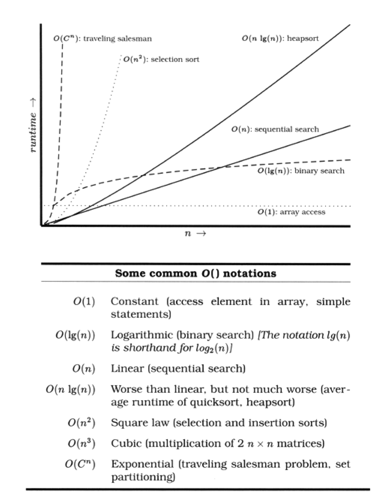

######## Algorithm Speed

########## How to Program Deliberately

- We always want to spend less tiem churning out code, catch and fix errors as early in the dev cycle as possible, and create fewer errors to begin with
- It helps if we can program deliberately
    * Always be aware of what you are doing
    * Don't code blindfolded
        - Attempt to build an application you can't fully understand, or to use a technology you aren't familiar with, is an invitation to be misled by coincidences
    * Proceed with a plan
    * Rely only on reliable things
        - Don't depend on accidents or assumptions
        - If you can't tell the difference in particular circumstances, assume the worst
    * Don't just test your code, test your assumptions as well
        - Don't guess; actually try it
        - Write an assertion to test your assumptions (see Assertive Programming)
        - If your assertion is rgiht, you have improved the documentation in your code
        - If you discover your assumption is wrong, you have discovered a bug
    * Prioritize your effort
        - Spend time on the important aspects; more than likely, these are the hard parts
        - If you don't have fundamentals or infrastructure correct, brilliant bells and whistles are irrelevant
    * Don't be a slave to history
        - Don't let existing code dictate future code
        - All code can be replaced if it is no longer appropriate
        - Even within one program, don't let what you've already done constrain what you do next - be ready to refactor
        - This decision `may` impact the project schedule
        - The assumtpion is that the impact will be less than the code of `not` making the change

- So next time something seems to work, and you don't know why, make sure it isn't a coincidence

######## Algorithm Speed

- Estimating resouces that algorithms use - time, processor, memory, and so on

- This kind of estimating is often cruical

- These questions can be answered using common sense, some analysis, and a way of writing approximations called the `big O` notation

########## What Do We Mean By Estimating Algorithms?

- Most nontrivial algorithms handle some kind of inpurt - sorting `n` strings, inverting an `m x n` matrix, or decrypting a message with an `n-bit` key
- Normally, the size of this input will affect the algorithm: the larger the input, the longer the running time or more memory used

- If the relationship were always linear (so that the time increased in direct proportion to the value of `n`), this section wouldn't be important
- `Most substantial algorithms are not linear`
- The good news is that many are sublinear
- A binary search doesn't need to look at every candidate when finding a match
- The bad news is that other algorithms are considerably worse than linear; runtimes or memory requirements that increase far faster than `n`
- An algorithm that takes a minute to process 10 items may take a lifetime to process 100

- We find that whenever we write anything containingl loops or recursive calls, we subconsciously check the runtime and memory requirements
- This is rarely a formal process, but a rather quick confirmation that what we're doing is sensible in the circumstances
- However, we sometimes `do` find ourselves performing a more detailed analysis, that's when the `O()` notation comes in useful

############ The O() Notation

- The O() notation is a mathematical way of dealing with approximations
- When we write that a particular sort routine sorts `n` records in O(n<sup>2</sup>), `we are simply saying that the worst-case TIME taken will vary as a square of n`
- Double the records, and the time will increase roughly four fold
- Think of O as meaning `on the order of`
- The O() notation puts an upper bound on the value of the thing we're measuring (time, memory, and so on)
- If we say a function takes O(n^2) time, then we know that the upper bound of the time it takes will not grow faster than n^2
- Sometimes we come up with fairly complex O() functions but because the highest-order term will dominate the value as `n` increases, the convention is to remove all low-order terms, and not to bother showing any constatnt multiplying factors `O(n^2/2 + 3n) is the same as O(n^2/2) which is equivalent to O(n^2)`
- This is actually a weakness of the O() notation - one O(n^2) algorithm may be 1000 times faster than another O(n^2) algorithm, but you won't know it from the notation
- Figure below shows several common O() notations you'll come across 



- For example, suppose you've got a routine that takes 1s to process 100 records
- How long will it take to process 1000 records?
- If your code is O(1) then it will take 1s
- If it is O(lg(n)) then you'll probably be waiting 3s
- O(n) will show a linear increase to 10s, while an O(n lg(n)) will take some 33 seconds
- If it's O(n^2), then it will take 100s
- If you have O(2^n) - exponential - it will take about 10^263 years

- `The O() notation doesn't just apply to time; you can use it to represent any other resources used by an algorithm`
- For example, it is often useful to be able to model memory consumption

############## Common Sense Estimation

- Simple loops
    * If a simple loop runs from 1 to `n`, then the algorithm is likely to be `O(n)` - time increases linearly with n
    * Examples include exhaustive searches, finding the max value in an array, and generating checksums

- Nested loops
    * If you nest a loop inside another loop, then your algorithm becomes O(m * n)
    * Where `m` and `n` are the two loops' limits
    * This commonly occurs in simple sorting algorithms, such as a bubble sort, where the outer loop scans each element in the array in turn, and the inner loop works out where to place that element in the sorted result
    * Such sorting algorithms tend to be O(n^2)

- Binary Chop
    * If your algorithm halves the set of things it considers each time around the loop, then it is likely logarithmic, O(lg(n))
    * A binary search of a sorted list, traversing a binary tree, and finding the first set bit in a machine word can all be O(lg(n))

- Divide and conquer
    * Algorithms that partition their input, work on the two halves independently, and then combine the result can be O(n * lg(n))
    * The classic example is quicksort, which works by partitioning the data into two halves and recursively sorting each
    * `Although technically O(n^2) b/c behavior degrades when it is fed sorted input, the average runtime of quicksort is O(n * lg(n))`

- Combinatoric
    * Whenever algoritms start looking for permutations of things, their running times may get out of hand
    * This is b/c permutations involve factorials (There are 5! = 5 * 4 * 3 * 2 * 1 = 120 permutations of the digits from 1 to 5)
    * Time is a combinatoric algorithm for 5 elements: it will take 6 times longer to run it for 6 and 42 times longer for seven
    * Examples include algorithms for many of the acknowledged `hard` problems - the traveling salesman problem, optimally packing things into a container, partitioning a set of numbers so that each set has the same total, and so on
    * Often, heuristics are used to reduce the running of these types of algorithms in particular problem domains

############## Algorithm Speed in Practice

- It's unlikely that you'll spend much time in your career writing sort routines
- The ones in the libraries available to you will probably outperform anything you may write without substantial effort
- However, the basic kinds of algorithms we've described earlier pop up time and time again
- Whenever you find yourself writing a simple loop, you know that you have an O(n) algorithm
- If that loop contains an inner loop, you know that you're looking at O(m * n)
- You should be asking yourself how large these values can get
- If the numbers are bounded, then you'll know how long the code will take to run
- If the numbers depend on external factors (such as the number of records in an overnight batch run, or the number of names in a list of people), then you might want to stop and consider the effect that large values may have on your running time or memory consumption

`Estimate the Order of Your Algorithms`

- There are some approaches you can take to address potential problems
- If you have an algorithm that is O(n^2), try to find a divide and conquer approach that will take you down to O(n * lgn(n))
- If you're not sure how long your code will take, or how much memor it will use, try running it, varying the input record count or whatever is likely to impact the runtime
- Plot the results
- You should soon get a good idea of the shape of the curve
- 3 or 4 test points should give you an idea

- Also consider just what you're doing int he code itself
- A simple O(n^2) loop may well perform better than a complex O(n * lg(n)) one for smaller values of `n`, particularly if the O(n * lg(n)) algorithm has an expensive inner loop

- In the middle of all this theory, don't forget that there are practical considerations as well
- Runtime may look like it increases linearly for small input sets
- But feed the code millions of records and suddenly the time degrades as the system starts to thrash
- If you test a sort routine with random input keys, you may be surprised the first tim eit encounters order input
- Try to cover both the theoretical and practical bases
- After all this estimating, the only timing that counts is the speed of your code, running in the prod environment, with real data

`Test your estimates`

- If it's tricky getting accurate timings, use `code profiliers` to count the number of times the different steps in your algorithm gets executes, and plot these figures against the size of the input

################ Algorithm Speed in Practice

- You also need to be pragmatic about choosing appropriate algorithms - the fastest one is not always best for the job
- Given a small input set, a straightforward insertion sort will perform just as well as a quicksort, and will take you less time to write and debug
- Also need to be careful if the algorithm you choose has a high setup cost
- This setup may dwarf the running time and make the algorithm inappropriate

- Always be way of `premature optimization`
- It's always a good idea to make sure an algorithm is really a bottleneck before investing your precious time trying to improve it


######## Code That's Easy to Test

- Software components should be combined just as integrated circuit chips are combined
- This works only if the components you are using are known to be reliable

- Chips are designed to be tested - not just at the factory, not just when they are installed, but also in the field whne they are deployed
- More complex chips and systems may have a full Built-in Self Test (BIST) feature that runs some base-level diagnostics internally, or a Test Access Mechanism (TAM) that provides a test harness that allows external environment to provide stimuli and collet responses from the chip

- Can do the same thing in software
- Need to build testability into the software from the very beginning, and test each piece thoroughly before trying to wire them together

########## Unit Testing

- Chip-level testing for hardware is roughly equivalent to `unit testing` in software - testing done on each module, in isolation, to verify its behavior
- We can get a better feeling for how a module will react in the system once we have thoroughly tested it under controlled conditions

- A software unit test is code that exercises a module
- Typically the unit test will establish some kind of artifical environment, then invokes routines in the module being used
- It then checks the results that are returned, either against known values or against the values from previous runs of the same test (regression test)

- Later when we assemble our `software IC's` into a complete system, we'll have confidence that the individual parts work as expected, and then we can use the same unit test facilities to test the system as a whole

########## Testing Against Contract

- Think of unit testing as `testing against contracted`
- We want to write test cases thta ensure that a given unit honors its contract
- This will tell us two things: whether the code meets the contract, and whether the contract means what we thnk it means
- Want to test that the module delivers the functionality it promises, over a wide range of test cases and boundary conditions

- What does this mean in practice?
- Example with simple contract

```
require:
    argument >= 0;
ensure:
    ((result * result).abs <= epsilon * argument;
```

- This tells us what to test
    * Pass in a negative argument and ensure that it is rejected
    * Pass in an argument of zero to ensure that it is accepted (this is the boundary value)
    * Pass in values between zero and the maximum expressible argument and verify that the difference btwn the square of the result and the original argument is less than some small fraction of the argument

- Armed with this contract, and assuming that our routine does its own pre and postcondition cheking, we can write a basic test script to exercise the square root function

```
public void testValue(double num, double expected) {
    try { // We may throw a
        result = mySqrt(num); //precondition exception
    }
    catch (Throwable e) {
        if (num < 0.0) // If input is < 0, then
            return; // we're expecting the
        else    // exception, otherwise
            assert(false)   // force a test failure
    }
    assert(Math.abs(expected - result) < epsilon * expected);
}
```

- Then we can call this routine to test our square root function

```
testValue(-4.0, 0.0);
testValue(0.0, 0.0);
testValue(2.0, 1.4142135624);
testValue(64.0, 8.0);
testValue(1.0e^7, 3162.2776602);
```

- This is a pretty simple test; in the real world, any nontrivial module is likely to be dependent on a number of other modules, so how do we go about testing the combination?

- Suppose we have a `module A` that uses a `LinkedList` and a `Sort`
- In order we would test:

1. `LinkedLists's` contract, in full
2. `Sort's` contract
3. A's contract, which relies on the other contracts but does not directly expose them

- This style of testing requires you to test subcomponents of a module first
- Once the subcomponents have been verified, then the module itself can be tested

- If `LinkedList` and `Sort's` tests passed, but A's test failed, we can be pretty sure that the problem is in A, or A's `us` in one of those subcomponents
- This technique is a great way to reduce debugging effort: we can quickly concentrate on the likely source of the problem within module A, and not waste tim reexamining its subcomponents

- Why go through all this trouble?
- Above all, we want to avoid creating a `time bomb` - something that sits around unnoticied and blows up at an awkard momement later in the project
- By emphasizing testing against contract, we can try to avoid as many of those downstream disasters as possible

`Design to Test`

- When you design a module, or even a single routine, you should design both its contract and the code to test that contract
- By designing code to pass a test and fulfill its contract, you may well consider boundary conditions and other issues that wouldn't occur to you otherwise
- There's no better way to fix errors than by avoiding them in the first place
- By building the tests `before` you implement the code, you get to try out the interface before you commit to it

########## Writing Unit Tests

- The unit tests for a module shouldn't be shoved in some far-away corner of the source tree
- They need to be conveniently located
- For small projects, you can embed the unit test for a module in the module itself
- For larger projects, we suggest moving each test into a subdirectory
- Either way, remember that if it isn't easy to find, it won't be used

- By making the test code readily accessible, you are providing devs who may use your code with two invaluable resources

1. Examples of how yo use all the functionality of your module
2. A means to build regression tests to validate any future changes to the code

########## Using Test Harnesses

- Because we usually write a lot of test code, and do a lot of testing, we'll make life easier on ourselves and develop a standard testing harness for the project

- A test harness can handle common operations such as logging status, analyzing output for expected results, and selecting and running the tests

- In OO languages and environments, you might create a base class that provides these common operations
- Individual tests can subclass from that and add specific test code

- Regardless of the technology you use to create this harness, it should include the following capabilities:
    * A standard way to specify setup and cleanup
    * A method for selecting individual tests or all available tests
    * A means of analyzing output for expected (or unexpected) results
    * A standardized form of failure reporting

- Tests should be composable; that is, a test can be composed of subtests of subcomponents to any depth
- We can use this feature to test selected parts of the system or the entire system just as easily, using the same tools

########## Build a Test Windows

- Even the best sets of tests are unlikely to find all the bugs

- This means you'll often need to test a piece of software once it has been deployed - with real-world data flowing through it
- We can provide various views into the internal state of a module w/o using a debugger

- Log files containing trace messages are one such mechanism
- Log messages should be in a regular, consistent format; you may want to parse them automatically to deduce processing time or logic paths that the program took
- Poorly or inconsistently formatted diagnostics are difficult to read and impractical to parse

- Another mechanism for getting inside running code is the `hot-key` sequence
- When this particular combination of keys is pressed, a diagnostic control window pops up with status messages and so on
- This isn't something you would normally reveal to end users, but it can be very helpful for the help desk

- For larger, more complex server code, a good technique for providing a view into its operation is to include a built-in web server
- Anyone can point a web browser to the application's http port (which is usally like 8080) and see internal status, log entries, and possibly even some sort of debug control panel
- Something like this is not hard to implement

########## A Culture of Testing

- All software you write `will` be testsed - if not by you and your team, then by the eventual users - so you might as well plan on testing it thoroughly
- A little forethought can go a long way toward minimizing maintenance costs and help-desk calls

`Test your software, or Your Users Will`

`Don't use Wizard Code You Don't Understand`